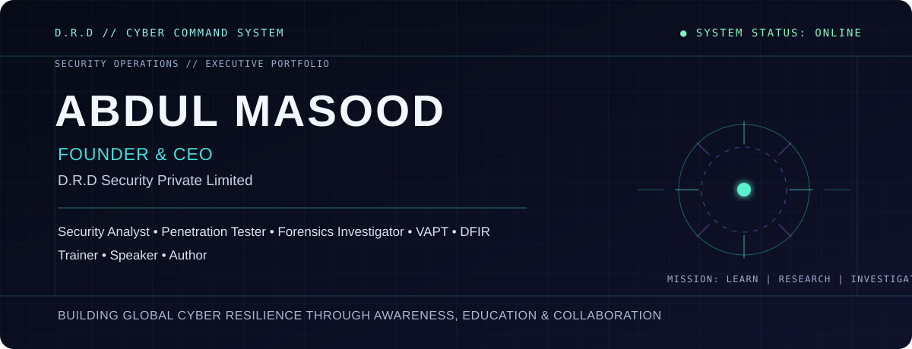

<div align="center">
  
</div>

<div align="center">
  
</div>

<br />

## `// ABOUT / COMMAND TERMINAL`

```text
drdsecurity@cyber-core:~$ whoami

Abdul Masood — Founder & CEO, D.R.D Security Pvt. Ltd.
Security Analyst | Penetration Tester | DFIR Investigator
Building secure systems, cybersecurity education, and practical research.

drdsecurity@cyber-core:~$ mission
Building global cyber resilience through awareness, education & collaboration.
```

## `// CYBER ARSENAL`

| Security operations | Engineering & cloud | Research & response |
| :-- | :-- | :-- |
| Networking · Linux · Penetration Testing · VAPT · Web Security · Mobile Security · IoT Security | Python · AWS · Cloud Security · Endpoint Security · Security Engineering | DFIR · Digital Forensics · Incident Response · Threat Hunting · Malware Analysis · Reverse Engineering · Threat Intelligence |

## `// CURRENT SYSTEMS`

| System | Scope | Status |
| :-- | :-- | :-- |
| [Cyber-Security-Road-maps](https://github.com/drdsecurity/Cyber-Security-Road-maps) | Public cybersecurity learning roadmaps and reference material. | Public repository |
| [Orignal-Slowloris-HTTP-DoS](https://github.com/drdsecurity/Orignal-Slowloris-HTTP-DoS) | Archived original Slowloris HTTP DoS script, retained as a public fork. | Public fork |

> Project listings are intentionally limited to verified public repositories. More work is available through the [D.R.D Projects portal](https://revolution.drdsecurity.com/).

## `// GITHUB INTELLIGENCE`

<div align="center">
  <code>[ <a href="https://github.com/drdsecurity?tab=repositories">EXPLORE PUBLIC REPOSITORIES</a> ]</code>
  &nbsp; <code>[ <a href="https://github.com/drdsecurity">VIEW LIVE PROFILE</a> ]</code>
</div>

<br />

GitHub’s native profile and contribution graph remain the source of truth for live activity. This profile avoids hard-coded counts and third-party statistic services.

## `// CONTRIBUTION / ACTIVITY`

<div align="center">
  <a href="https://github.com/drdsecurity">
    <picture>
      <source media="(prefers-color-scheme: dark)" srcset="https://raw.githubusercontent.com/drdsecurity/drdsecurity/output/github-contribution-grid-snake-dark.svg" />
      <source media="(prefers-color-scheme: light)" srcset="https://raw.githubusercontent.com/drdsecurity/drdsecurity/output/github-contribution-grid-snake.svg" />
      
    </picture>
  </a>
</div>

## `// RESEARCH AREAS`

<div align="center">

`CYBERSECURITY` &nbsp; `SECURITY RESEARCH` &nbsp; `PENETRATION TESTING` &nbsp; `DFIR` &nbsp; `THREAT INTELLIGENCE`<br />
`CLOUD SECURITY` &nbsp; `MALWARE ANALYSIS` &nbsp; `INCIDENT RESPONSE` &nbsp; `AI IN CYBERSECURITY`

</div>

## `// D.R.D SECURITY`

> **D.R.D Security Pvt. Ltd.** is the command center for focused security learning, research, and investigation.
>
> `LEARN | RESEARCH | INVESTIGATE`

<div align="center">
  <code>[ <a href="https://drdsecurity.com">VISIT DRDSECURITY.COM</a> ]</code>
</div>

## `// CONNECT`

<div align="center">
  <a href="https://drdsecurity.com">Website</a> &nbsp;•&nbsp;
  <a href="https://www.linkedin.com/company/d-r-d-security">LinkedIn</a> &nbsp;•&nbsp;
  <a href="https://www.youtube.com/@D.R.DSecurity">YouTube</a> &nbsp;•&nbsp;
  <a href="https://www.instagram.com/drd_5ecurity">Instagram</a> &nbsp;•&nbsp;
  <a href="https://discord.gg/WStgbRJ5gm">Discord</a> &nbsp;•&nbsp;
  <a href="https://github.com/drdsecurity">GitHub</a>
</div>

<br />

<div align="center">
  <code>drdsecurity@cyber-core:~$ Building secure systems. Empowering people. Securing the future.</code>
</div>
