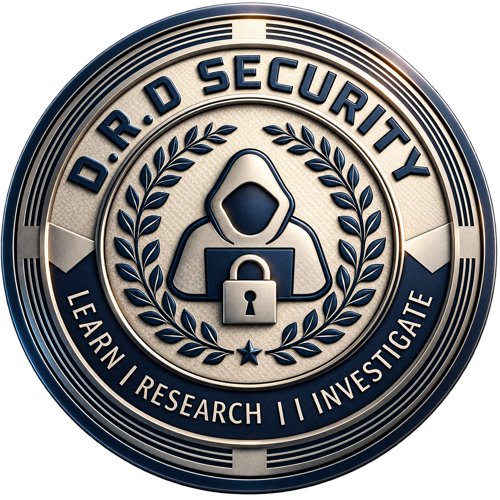
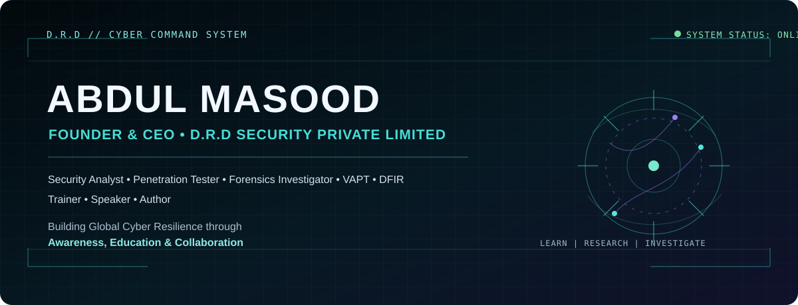

  
   
  

# Abdul Masood

**Founder &amp; CEO — D.R.D Security Private Limited**

Security Analyst &bull; Penetration Tester &bull; DFIR Investigator &bull; VAPT &bull; Cybersecurity Trainer &bull; Security Research

> Building Global Cyber Resilience through Awareness, Education &amp; Collaboration.

| Public Repositories | GitHub Profile | Security Focus | Research | Full Portfolio |
| :-- | :-- | :-- | :-- | :-- |
| Public | Active | Cybersecurity | Research Active | Online |

  
   
  Interactive Cybersecurity Portfolio &amp; Command Profile

## Executive Profile

Abdul Masood leads D.R.D Security Private Limited with a focus on practical security analysis, resilient systems, and cybersecurity education.

- Security Analysis, Penetration Testing, VAPT, and DFIR
- Digital Forensics, Security Research, and Cybersecurity Training
- Building global cyber resilience through awareness, education, and collaboration

## Cyber Arsenal

  <code>Networking</code> <code>Linux</code> <code>Penetration Testing</code> <code>VAPT</code> <code>DFIR</code> <code>Digital Forensics</code> 
  <code>Incident Response</code> <code>Malware Analysis</code> <code>Reverse Engineering</code> <code>Web Security</code> <code>Mobile Security</code> <code>IoT Security</code> 
  <code>Endpoint Security</code> <code>AWS</code> <code>Cloud Security</code> <code>Threat Hunting</code> <code>Python / Scripting</code> <code>Security Research</code>

## Command Systems

| System | Command Focus |
| :-- | :-- |
| **LYRA AIOS** | AI-driven cyber intelligence / operating system. |
| **DRD Guardian Suit** | Advanced futuristic cyber-protection suit platform. |
| **DRD Guardian HL150** | Autonomous high-altitude logistics and mission-support UAS. |
| **DRD Vajra-X** | Next-generation AI-integrated advanced battle platform. |

## Research Areas

| | |
| :-- | :-- |
| AI in Cyber Security | IoT Security |
| Malware Analysis | Cloud Security |
| Threat Intelligence | DFIR &amp; Incident Response |

## GitHub &amp; Public Signals

GitHub’s native profile and contribution graph remain the source of truth for public activity. This profile intentionally avoids hard-coded repository, follower, star, and contribution counts.

- [View GitHub profile](https://github.com/drdsecurity)
- [Explore public repositories](https://github.com/drdsecurity?tab=repositories)

## Technology Signals

<code>Python</code> <code>JavaScript</code> <code>TypeScript</code> <code>HTML</code> <code>CSS</code> <code>Linux</code> <code>AWS</code>

## Evidence Before Acclaim

- Verified records only
- Public evidence where available
- Achievements added after verification

## Connect

- [GitHub](https://github.com/drdsecurity)
- [Website](https://drdsecurity.com)
- [Interactive Portfolio](https://drdsecurity.github.io)

---

  <strong>D.R.D SECURITY</strong> 
  <code>LEARN | RESEARCH | INVESTIGATE</code> 
  Building Global Cyber Resilience. 
  <a href="https://drdsecurity.github.io">Enter the full interactive portfolio</a>

